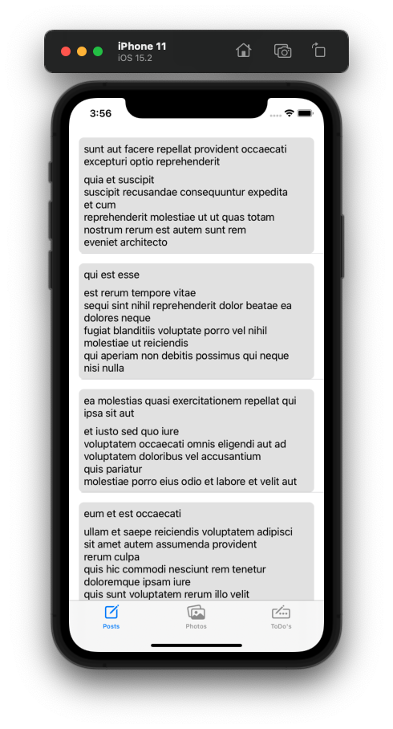
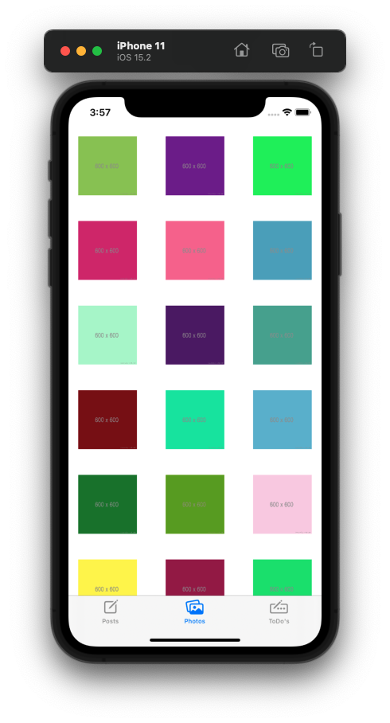
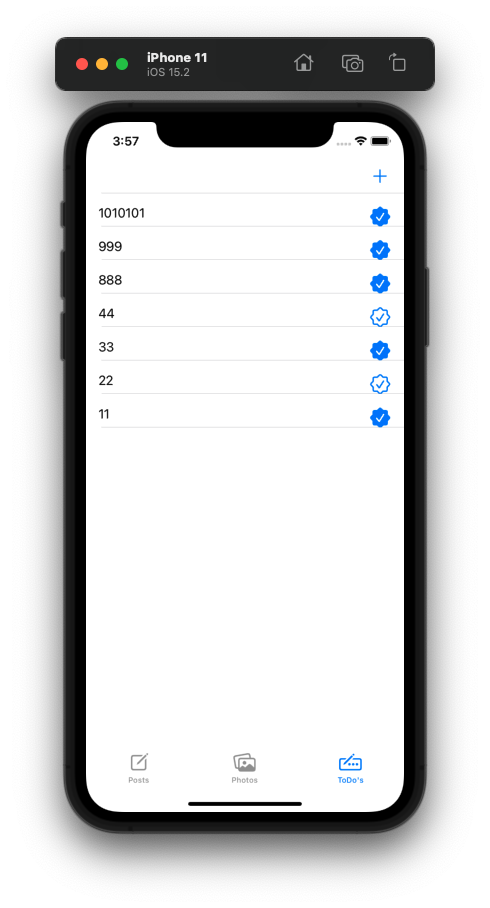
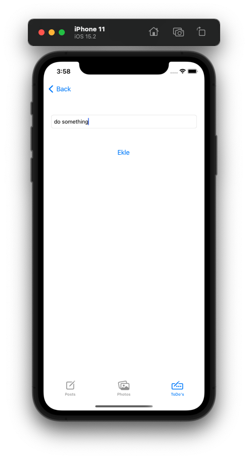
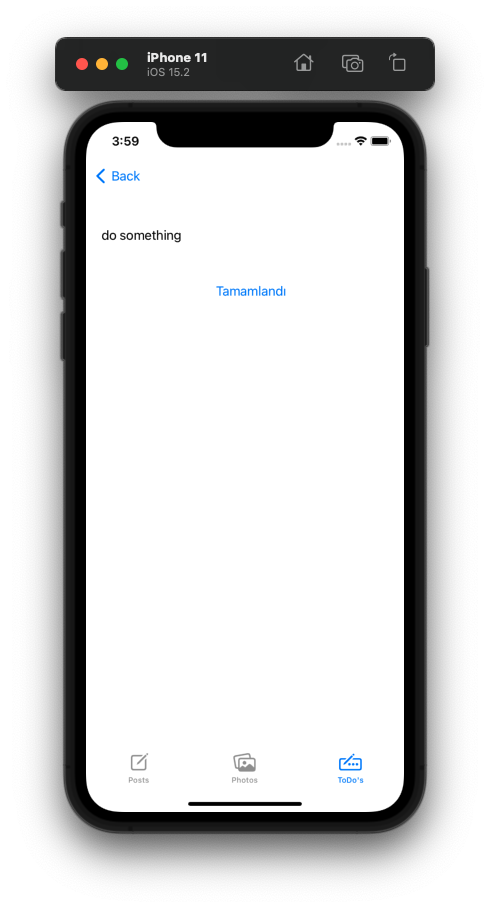

# FMSS-Homework-3

## Özet

- Birinci Tab'de bir API'den gelen veriler gösterilir. 
- İkinci Tab'de bir API'den gelen görseller gösterilir.
- Üçüncü Tad'de ise bir ToDo uygulaması bulunur.
    - ToDo Tab'inde navigasyon butonu bulunur. Bu butona tıklandığında todo ekleme sayfası açılır.
    - Todo yazılıp eklendiğinde liste ekranına döner ve eklenen todo en üstte gözükür.
    - ToDo Tab'inde seçilen her todo için detay todo sayfası açılır.
---

    

    </img></img>

    

    </img></img></img>

---

## Tools
- Swift
    - MVVM Design Pattern
    - Kingfisher
    - UrlSession
- UIKit
    - TabBar 
    - Navigation Controller 
